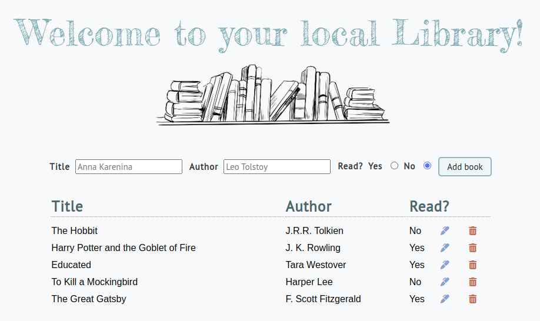

# Library
## Introduction

This project is an app that stores and displays books in a digital library. It is built using the standard front-end stack of HTML, CSS and JavaScript.

The project primarily demonstrates use of constructors/classes in JavaScript to create objects, as well as local storage.

## Preview

## Media credits:

1. Flaticon: https://www.flaticon.com/free-icon/open-book

2. iStock: https://www.istockphoto.com/vector/books-on-the-bookshelf-hand-drawn-sketch-illustration-vector-with-transparent-gm1266468960-371276574